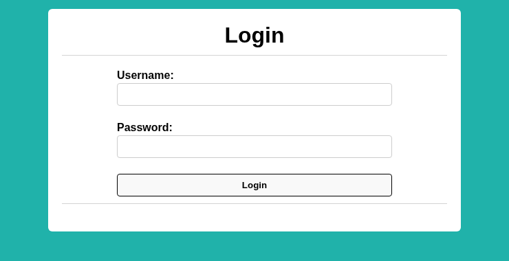

# Fool the Lockout-PicoCTF-2026

---

### Web Exploitation - Medium - (Source code)

---

#### Description:

#### Your friend is building a simple website with a login page.

#### To stop brute forcing and credential stuffing, they’ve added an IP-based rate limit: exceed the attempt threshold and your IP is blocked for a while. They’re convinced this makes guessing credentials impossible.

#### To test their defense, they’ve:

#### Created a dummy account with a random username–password pair from public credential lists.

#### Given you those username and password lists.

#### Shared the full source code.

#### Can you bypass the rate limit, log in, and capture the flag?

---

- The application displays a login form when I access it.
    
    
    
- Based on the description, my goal is to use this credential list to brute-force the login form. This list contains 100 lines.
    
    
    
- But I want to know how the rate limit works first, I use Burp Intruder to confirm that after 10 failed attempts, my IP gets blocked for a while.
    
    
    
- Since this is IP-based rate limit, and many applications trust the `X-Forwarded-For` header when deployed behind a reverse proxy, I tested whether adding this header would make the server treat each request as coming from a different IP. Turns out it doesn’t work.
    
    
    
- From this moment, I decide to read the source code to know better about how this rate limit is implemented.
- Here’s the entire `/login` route, and I see a function call to perform rate limit here, the rest is just normal login logic.
    
    
    
- Before even looking at the `exceeded_rate_limit()` , at the top of the source code, there’s some static value has been set, and they even comment the purpose of these, if I understand correctly, my IP will be blocked for 2 mins if I failed 10 times in 30 seconds.
    
    
    
- Only need those lines and I’ve already have enough information to come up with a bypass idea, If i send only 9 requests and then wait 31s (just to be sure), I will never reach the lockout and will be able to continue brute-forcing every 31s.
- But I’m still going to explain what’s necessary.
    - This is a dictionary to store the format of the logged IP address.
        
        
        
    - About the `refresh_request_rates_db()` ,whenever there’s a request from an IP, this function does 2 things:
        - If more than 30s have passed since the first count, set `num_request = 0` and `epoch_start = -1` , consider as start counting from the beginning.
        - If being blocked and the time limit has expired, set `lockout_until = -1` , consider as unlocked.
            
            
            
    - Finally, the main function `exceeded_rate_limit()` :
        - Flask get the IP from TCP connection, not form client, this is why the `X-Forwarded-For` header doesn’t work.
            
            
            
        - Then call `refresh_request_rates_db()` to refresh any old data (If exists), if this IP address has never appeared in the request_rates dictionary (first visit), create a new entry with the default values: no requests, counting not yet started, not blocked.
            
            
            
        - Only count POST requests, each time a POST request arrives, `num_requests` increase by 1. If this is the first request in a new "cycle" (`epoch_start == -1`, meaning the count hasn't started yet or has just been reset), then record the start time of the count (This is the `epoch_start` time that the `refresh_request_rates_db` function uses to compare with `EPOCH_DURATION`(30s)).
            
            
            
        - This is the part that decides everything, If `num_requests` has exceeded `MAX_REQUESTS` , meaning the 11th request onwards:
        - If `lockout_until` has never been set (currently -1), set it to `curr_time` + `LOCKOUT_DURATION` (120 seconds from now), then return `True` (block request from this IP). If the limit has not been exceeded, then return False (allow the request to proceed normally).
            
            
            
- But there’s something missing, the code only blocks IP based on whether I’ve exceeded `MAX_REQUESTS` or not, `lockout_until` is set but never actually checked anywhere to enforce the block , and `num_requests` will always be refreshed to 0 after 30s, it means even during the lockout period, I can still send request after 30s counted from the first request in that batch and loop it unlimited until I found the correct credential.
- Using a python script is my favorite way to solve these brute-force things, here the script (AI supported):
    
    ```python
    import requests
    import time
    
    BASE_URL = "http://candy-mountain.picoctf.net:[PORT]"
    LOGIN_URL = f"{BASE_URL}/login"
    CREDS_FILE = "creds-dump.txt"
    BATCH_SIZE = 10          
    WAIT_SECONDS = 30        
    
    headers = {
        "Content-Type": "application/x-www-form-urlencoded",
        "Origin": BASE_URL,
        "Referer": LOGIN_URL,
    }
    
    def try_login(username, password):
        resp = requests.post(
            LOGIN_URL,
            headers=headers,
            data={"username": username, "password": password},
            allow_redirects=False,   
            timeout=10,
        )
        
        if resp.status_code == 302:
            return True
        return False
    
    def load_creds(filepath):
        creds = []
        with open(filepath, "r") as f:
            for line in f:
                line = line.strip()
                if not line or ";" not in line:
                    continue
                username, password = line.split(";", 1)
                creds.append((username, password))
        return creds
    
    def main():
        creds = load_creds(CREDS_FILE)
        total = len(creds)
        print(f"[*] Loaded {total} credential pairs")
    
        for i in range(0, total, BATCH_SIZE):
            batch = creds[i:i + BATCH_SIZE]
            print(f"\n[*] Batch {i // BATCH_SIZE + 1} — trying {len(batch)} creds "
                  f"({i+1}-{i+len(batch)}/{total})")
    
            for username, password in batch:
                print(f"    [-] Trying {username}:{password}")
                if try_login(username, password):
                    print(f"\n[+] SUCCESS! username={username} password={password}")
                    return
    
            print(f"[*] Batch done, waiting {WAIT_SECONDS}s before next batch...")
            time.sleep(WAIT_SECONDS)
    
        print("\n[-] Exhausted credential list, no valid login found.")
    
    if __name__ == "__main__":
        main()
    
    ```
    
- After running the script, I captured the valid credential.
    
    
    
- Then use it to login and get the flag (or I could do this directly with python but I’m too lazy to edit the script)


- Root cause:
    - Rate limit enforcement relies solely on a request counter that gets
    reset every `EPOCH_DURATION`, while the `lockout_until` timestamp is
    set but never actually checked to gate requests, the two mechanisms
    are disconnected, so the shorter epoch window (30s) silently
    overrides the intended longer lockout window (120s).
