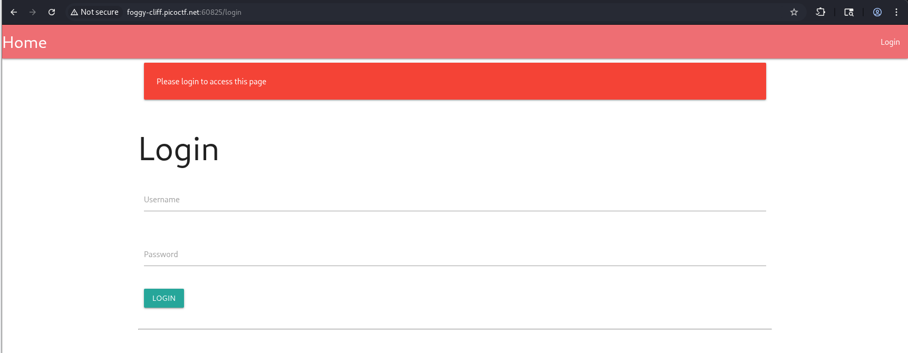

# No FA-PicoCTF-2026

### Web exploitation - Medium - 200 pts

#### Challenge description: Seems like some data has been leaked! Can you get the flag?

- This CTF give me 3 things:
    - The web app
    - The source code
    - The leaked data file
- Here is what I witness when accessing the web, it sends me directly to the login page.

- At the same time I also check the source code and see this piece of code, quick explanation below:
    - If you are not logged in, redirect to the login page.
    - If you are logged in and are `admin`, show the flag.

- In order to login as admin, we need to know the `username` (in this case it already is `admin`) and the `password`, this is where the leaked data file engages in, so I `cat` it and it looks like a mess here but I notice the first line that displays something something sqlite.

- So I open it again with `sqlite3` and now it’s easier to read, from here I can see the password hash of admin, which is `c20fa16907343eef642d10f0bdb81bf629e6aaf6c906f26eabda079ca9e5ab67` .

- And from this line of the source code, I also know that the password is hashed with no salt.
- (Salt is a random string that is added to the password before hashing to make the hash different even if the original string is the same)
- (We can’t recalculate the correct hash if we don’t know the salt)

- Then I take it to `Crackstation` to see if it has any record of that hash (of course with no salt), and I see one record which is `apple@123` .

- I use the credential above and login, now I face the 2FA.

- I look at the source code again and see the condition here, I need to enter the correct otp in less than 2 mins, brute force is also a good idea but no need to do that.

- Because the correct otp is stored in the session cookie already.

- So I go check the cookie, although it looks like JWT, but since the dot (`.`) is the first character and this app is written in Python, I can conclude that this is Flask session.
- (The main problem here is, the app give us the cookie even when we are not completely authenticated)

- After that, I go to this site to decode the cookie and the OTP is shown there

- Now with the OTP, I can pass the 2FA and successfully login to get the flag.

- Root cause:
    - Password hashing without salt → same password always produces the
    same hash, making it crackable via lookup services like Crackstation.
    - Session cookie is issued right after step 1, before 2FA is completed
    → sensitive data (the OTP) ends up stored client-side in a readable
    cookie.
    - (Alternative) Weak rate limiting on OTP verification → a 4-digit OTP
    is still brute-forceable within the 2-minute window if there's no
    attempt-count lockout.
