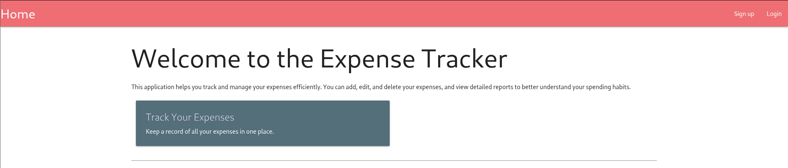

# ORDER ORDER-PicoCTF-2026

---

### Web Exploitation - Hard

---

#### Description:

#### Can you try to get the flag from our website. I've prepared my queries everywhere! I think!

---

- Accessing the challenge, this application seems to be used for tracking something, I also notice 2 buttons, one for `Login` and one for `Sign up` at the top right.
    
    
    
- I decide to test the `Login` first, by injecting the single quote to both fields, but I only obtain a normal error message.
    
    
    
- Moving to the `Sign up` , I also try injecting the same thing as before.
    
    
    
- Surprisingly it’s success, then I run a few more tests and come to the conclusion that both of the `login` and `the sign` up allow me to enter EVERYTHING on the input fields.
    
    
    
- After logging in, I see more buttons.
    
    
    
- Checking the `dashboard` and this is how it looks like, it seems to display all my activities here.
    
    
    
- Moving to the `Expenses` , here I can add an expense then generate report for all of them, I also try injecting every fields I can control with a single quote.
    
    
    
- Clicking `Generate Report` button sends the report to `Inbox` and it allows me to download that report.
- I also notice the error message saying that there’s something wrong with token `"'test''"` , meaning my input triggered an error in a certain query. (This is second order SQLi, since my input doesn’t trigger right after submitting and only trigger after that at somewhere else).
- At this point, I know that the injection is happening somewhere after the input has already been stored. However, I have injected `test'` into 3 different fields, so I still don’t know which value is being reused when generating the report.
    
    
    
- I test them one by one. When I use `test'--` as the username.
    
    
    
- And the error disappears during report generation, confirming that the stored username is the value being inserted into the vulnerable query.
    
    
    
- Now that I have confirmed the injection point and can see database errors directly, I switch to a UNION-based approach to understand the structure of the underlying query.
- My first goal is to determine the number of columns returned by the original query and also which of them are visible to the user using this payload.
- (Even white-space is allowed).
    
    
    
- Now it says the number of columns doesn’t match, I just need to increase the number of columns in my payload until I find the correct number.
    
    
    
- Using `test' union select 1,2,3--` as the username and now the error is gone again, indicating the original query returns 3 columns, but I still don’t know which of them are displayed.
    
    
    
- After downloading and opening it, I can see that all of them are displayed.
- (From here you can see the payload I used directly in the file name `report_[PAYLOAD]_[some_numbers].csv`).
    
    
    
- Next, I figure out which DBMS is being used, I ask AI to give me the query for checking the DBMS version and have this list.
    
    
    
- Took me a while to gather the DBMS, from now I just need to inject using sqlite syntax and the rest will be a piece of cake.
    
    
    
- The next step is to gather all the tables, there’s a table with a weird name, I’ll check it first because it’s likely to be the flag, nothing personal.
    
    
    
- I use this payload to see the whole query used to create that table, and now I know all the column names.
    
    
    
- Then I use this payload to get the flag.
    
    
    
- Root cause:
    - Second-order SQL injection via stored username reused unsafely downstream:
    the login and signup endpoints correctly use parameterized queries (a single
    quote at signup/login doesn't break anything), but the username is stored
    as raw, unvalidated text. When the report-generation feature later builds a
    query using that stored username, it concatenates the value directly into
    SQL instead of parameterizing it, so the injection payload survives
    storage completely inert, then detonates at a completely different code
    path and endpoint than where it was submitted.
    - Inconsistent use of prepared statements across the codebase, not absence
    of them, this is the actual point of the challenge title/description:
    most queries in the app are safe, which is exactly what makes this class of
    bug dangerous. A single unparameterized sink is enough to compromise the
    whole database, and it's harder to catch in review than a codebase with no
    parameterization at all, because most inputs "look" safe when tested
    directly at their entry point.
    - No output-side validation either, nothing constrains what a username can
    contain (quotes, SQL keywords, whitespace all pass through unfiltered at
    signup), so the field silently doubles as a staging area for arbitrary SQL
    that only executes once a different feature (report generation) touches it.
    - Chain amplified by direct sqlite_master access, once the injection point is
    confirmed, the UNION-based read isn't limited to app tables; querying
    sqlite_master exposes full schema (table names, then CREATE TABLE
    statements via the `sql` column) with no restriction, turning one
    injectable field into complete database enumeration.
    
    Takeaway: parameterizing the query at the point of user input isn't enough if
    that same stored value gets concatenated into a different query later, every
    downstream consumer of stored data needs the same discipline, or the "safe"
    entry point is irrelevant.
