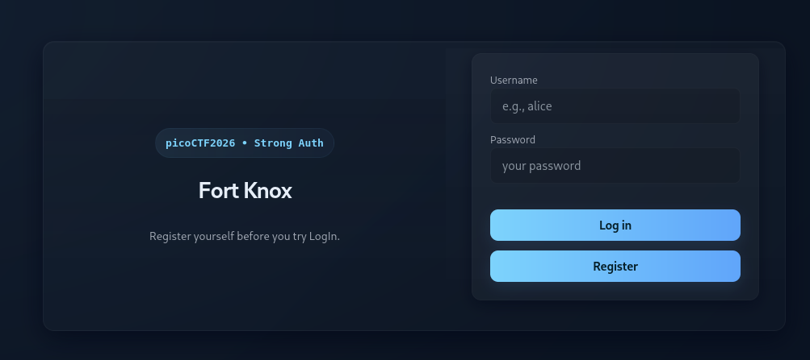

# Sql Map1-PicoCTF-2026

---

### Web exploitation - Medium

---

#### Description:

#### You’ve been hired by a shadowy group of pentesters who love a good puzzle. The system looks ordinary, but appearances lie. Somewhere inside, sloppy code and legacy hashing practices left a tiny, perfect doorway for an attacker.

#### Your mission — should you choose to accept it — is to slip through that doorway, act as a legit user and retrieve the secret flag.

---

- Accessing the application, I see a login form and a button to register an account.
    
    
    
- I try injecting single quote to both field but none of them seem to trigger any error.
    
    
    
- After that I create an account `test:test` then log in, now I’m presented with a search bar.
    
    
    
- So I enter a string `test` to see how the application handles my input and it seems secured so far.
    
    
    
- Here the interesting part comes, since I see a lot of `flag` word in the form, I change the search key word to `flag` and it displays about 6 flags.
- (Only need to spend around 2 mins of submitting each of them and you have lost 2 mins of your day)
    
    
    
- Next, I inject single quote to the search field and it throws an error eventually, indicating that it’s vulnerable to SQLi, but it only return the exact location where the error occured instead of displaying the whole query. (Making it a little bit harder to be injected manually if it has complex structure)
- (Note: from the error, I can gather the DBMS being used and also the webroot path)
    
    
    
- This time I try the payload `test' or 1=1--` and now it return everything in its `current table` , meaning I can now inject malicious query without triggering any error.
    
    
    
- Because this is a search bar, the query being used must be a SELECT statement, and it also displays results, so using the UNION technique seems like a reasonable approach to extract data in these cases. By changing the payload to `test' union select 1,2--` , I know that the underlying query returns 2 columns, and both of them are reflected in the response.
    
    
    
- From here, I prefer using `sqlmap` because I’m too lazy to inject manually and also I don’t remember the syntax of each DBMS.
- Copy the whole request in Burp to a text file, because I don’t remember too much `sqlmap` arguments/options either, so let it reads a file not only reduce a lot of arguments/options but also is the safest way to do.
    
    
    
- Then I run the command `sqlmap -r test.txt --batch --dump --technique=U --fresh-queries` , since I already know UNION can be used, specifying it in the command will help saving the time.
    
    
    
- Observing the result of table `users` , I see my account and another account that sqlmap can crack its password, which is `ctf-player:dyesebel` , the remaining password can’t be cracked because it has salt or something I’m not sure.
    
    
    
- And here is the table being used to displays result for the search bar.
    
    
    
- Then using the cracked credential above to log in, it fortunately contains the real flag.
    
    
    
- Root cause:
    - SQL Injection via unparameterized query on the search endpoint: the `q`
    parameter is concatenated directly into a SELECT statement instead of using
    a parameterized query, confirmed by the SQLite error thrown on a single
    quote and then bypassed cleanly with `' or 1=1--`. Because the query is a
    SELECT feeding a results list, the UNION technique applies directly, and
    once the column count is fixed at 2, the injection point becomes a full
    read primitive across every table in the database — not just the intended
    `flags` table, but `users` as well.
    - Verbose error output discloses server internals: triggering the injection
    with a single quote returns the raw SQLite3 driver error along with the
    absolute server path (`/var/www/html/vuln.php`, line numbers included).
    This isn't independently exploitable, but it hands an attacker free
    reconnaissance: confirmed DBMS type and filesystem layout, without needing
    to fingerprint either.
    - Passwords hashed with unsalted MD5: the `users` table stores raw 32-char
    MD5 digests with no per-user salt. MD5 is designed to be fast, which is
    the opposite of what password hashing needs — combined with no salt,
    identical passwords always produce identical hashes, so any password that
    exists in a common wordlist (like `ctf-player`'s) falls to a dictionary
    attack in seconds, as sqlmap's built-in cracking demonstrated with zero
    extra tooling.
    - Combined effect: the SQLi alone would only expose hash values, not
    plaintext credentials — but pairing it with unsalted MD5 turns "read the
    users table" into "log in as any user with a common password," collapsing
    two separate weaknesses into one full authentication bypass chain.
- Takeaway: SQLi severity compounds with whatever it exposes: a strong hashing
scheme (bcrypt/argon2 with salt) would have kept this at "attacker can read
hashes" instead of "attacker can log in," even with the same injection
untouched.
