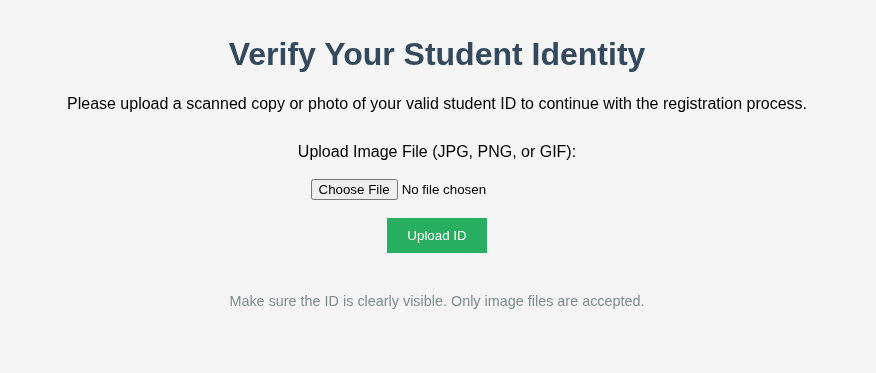

# byp4ss3d-PicoMini

---

### Web Exploitation - Medium

---

#### Description:

#### A university's online registration portal asks students to upload their ID cards for verification. The developer put some filters in place to ensure only image files are uploaded but are they enough? Take a look at how the upload is implemented. Maybe there's a way to slip past the checks and interact with the server in ways you shouldn't.

---

- When accessing the application, I see a form that allows uploading image file. What I’m gonna do is I will try uploading a webshell to obtain RCE.
    
    
    
- Then I check the request in Burp and know that this is an Apache server and written in PHP by looking at the response header.
    
    
    
- So I immediately create a simple PHP webshell file.
    
    
    
- And try uploading but of course the server blocks it.
    
    
    
- Next, I try using other PHP extensions to see if any can pass the blacklist.
- Most of them passed, and from here I figure out that the server only uses blacklist for extension without checking the Content-type and MIME-type or even the actual file content.
    
    
    
- When I access each of them, they only display the payload in plaintext instead of executing it.
- I did some research and came up with this theory:
- This is because Apache server looks at the file extension and compares it to the MIME-Type configuration in its `httpd.conf` file.
- By default, if Apache is not explicitly configured to "Use PHP to translate .phtml or .php5,… files," it will treat these extensions as plain text or unknown files. Instead of executing the PHP code inside, Apache simply reads the file contents and returns the plain text to the browser.
    
    
    
- Since I’ve successfully uploaded the file, I won’t try using double extension here, because it only leads to the same result of not executing the payload.
- After reading the hint, I have another approach using `.htaccess` file, this is a configuration file for the Apache web server, placed directly within a directory, which allows overriding configurations specifically for that directory (and its subdirectories) without needing to modify the main Apache configuration file (`httpd.conf`).
- The idea is to upload a custom `.htaccess` file to alter how Apache processes files in that directory and turn a "harmless" uploaded file into a tool for code execution.
- But I must meet these conditions for this technique to work:
    - Web server must be Apache (because Nginx doesn’t read `.htaccess`).
    - The Apache configuration must have `AllowOverride All` (or at least `AllowOverride FileInfo`) enabled for the upload directory, if `AllowOverride None` is set, the `.htaccess` file will be completely ignored by Apache and will have no effect.
    - The application must allow uploading files with arbitrary content (without checking the content itself, only the filename or extension) and must not rename the file upon saving (if the application automatically renames `.htaccess` to something else, this technique won’t work).
- I can’t control any of those conditions above except knowing the web server is Apache. So the only way to know is to actually try it, and I successfully uploaded the .htaccess file. (I change the Content-type to `text/plain` just to be sure, but since this application doesn’t care about anything but the file extension, you can put in anything you want).
- `AddType application/x-httpd-php .jpg` : this line tells Apache that “Hey, let’s treat all the files with .jpg extension in this directory as PHP files and execute them!!!”
    
    
    
- Then I upload a webshell file with `jpg`  extension.
    
    
    
- After accessing it, I obtain RCE.
    
    
    
- And find out the flag location after some traveling.
    
    
    
- Finally, cat it to get the flag.
    
    
    
- Root cause:
    - Extension filtering implemented as a blacklist, not a whitelist: the
    application rejects a fixed set of known-dangerous extensions (.php,
    .php7...) but has no allowlist of acceptable image types, so any extension
    not explicitly blocked (.htaccess, .phtml variants that Apache doesn't map,
    .inc) passes through by default. Blacklists are inherently incomplete: they
    require the developer to enumerate every dangerous case in advance, while a
    whitelist only needs to enumerate the safe ones.
    - No validation of actual file content or MIME type: the upload handler
    trusts the filename/extension alone and never inspects the file's magic
    bytes or declared Content-Type against its real content. This is what lets
    a plaintext Apache config file (.htaccess) and a PHP webshell (renamed
    .jpg) both pass as "images" with zero resistance, the check never looks
    past the name.
    - Upload directory allows configuration override: AllowOverride is enabled
    for the images/ directory, and uploaded files are stored under their
    original name without renaming or sanitization. This turns the missing
    content check into full RCE: an attacker-controlled .htaccess can
    redefine how Apache handles subsequent uploads in that directory
    (`AddType application/x-httpd-php .jpg`), so a file that would otherwise
    just sit inert as a wrongly-labeled image becomes executable PHP.
    - Chain dependency: each layer alone would have contained the impact, a
    whitelist stops the .htaccess upload entirely; content validation catches
    the PHP payload regardless of extension; AllowOverride None neuters the
    .htaccess even if uploaded. All three failing together is what escalates a
    cosmetic upload filter into remote code execution.

Takeaway: extension blacklisting is a weak first line of defense on its own,
pair it with content-based validation (magic byte / MIME sniffing) and lock
down directory-level Apache overrides so a single missed check can't cascade
into RCE.
